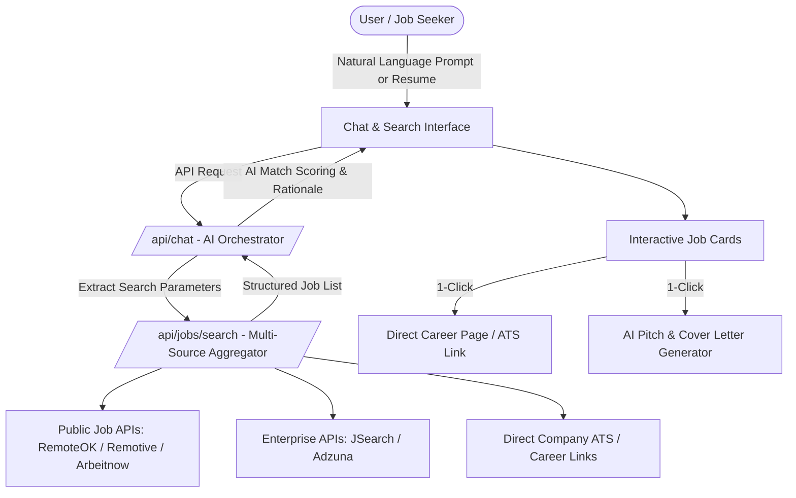

# Implementation Plan - AI Job Search Chatbot MVP ("CareerBot AI")

Build an AI-powered conversational job search platform with a modern chat interface, direct career page links, multi-source job data aggregation, interactive job cards, and resume-assisted matching.

## User Review Required

> [!IMPORTANT]
> **API Keys & Data Sources:**
> - The MVP will come with out-of-the-box **zero-config live job data providers** (such as Remotive, RemoteOK, and Arbeitnow REST APIs) that work immediately without requiring API keys.
> - It will also support optional API keys for **JSearch (RapidAPI)** or **Adzuna** for broader worldwide/enterprise queries, configurable via an in-app settings drawer or `.env.local`.
> - For conversational AI responses, it will support built-in LLM providers (e.g. Google Gemini API / OpenAI API / free simulated intelligence fallback if no key is entered).

## Key Features & Architecture

### 1. Conversational AI Chat Interface
- Clean conversational UI with instant streaming and smart suggestion pills.
- Understands complex search criteria: roles, tech stacks, salary thresholds, remote/hybrid preferences, country/city filters, and experience level.
- Resume upload / paste support to extract skills automatically and find tailored jobs.

### 2. Rich Interactive Job Cards
- Company name, logo, role title, location, salary range, and job tags.
- **AI Match Indicator**: Highlights matching skills and provides a quick reason why the position fits.
- **Direct Career Page Link**: Direct button linking to the company's verified application portal / ATS (Greenhouse, Lever, Workday, or direct career page).
- **"Tailor My Pitch" Generator**: Generates custom cover note bullets specifically matching the user's background to the job description.
- **Saved Jobs / Bookmarking**: Allows users to save favorite listings to a persistent drawer.

### 3. Multi-Source Job Aggregator Engine
- Unified backend service that queries live job feeds and structures them into a clean JSON schema:
  - `title`, `company`, `location`, `remote`, `salary`, `apply_url`, `company_url`, `description`, `tags`, `posted_at`.
- Direct fallback search engine for specific company career pages when users ask *"Show me open roles at Stripe / Vercel / Google"*.

---

## Proposed Changes

We will create a new Next.js project in `C:\Users\ASUS\.gemini\antigravity\scratch\career-bot-ai`.

### Project Setup & Dependencies
#### [NEW] `package.json`, `tailwind.config.ts`, `tsconfig.json`, `next.config.ts`
- Next.js 14/15 with TypeScript, Tailwind CSS, Lucide React icons, and clsx / tailwind-merge.

### Core Backend & APIs
#### [NEW] `src/types/job.ts`
- TypeScript definitions for `JobListing`, `JobSearchQuery`, `ChatMessage`, `SavedJob`, and `MatchScore`.

#### [NEW] `src/lib/job-providers.ts`
- Aggregator querying:
  - Remotive API (Tech, Sales, Design, Marketing, Dev roles)
  - RemoteOK API (Global remote tech jobs)
  - Arbeitnow API (European & global tech jobs)
  - JSearch / Adzuna integration hooks for custom key config
  - Company career page deep-link resolver.

#### [NEW] `src/app/api/chat/route.ts`
- Conversational endpoint that parses user intent, executes job search functions, scores matches, and generates conversational advice with structured job cards.

#### [NEW] `src/app/api/jobs/search/route.ts`
- Direct REST search endpoint supporting filtering by keyword, location, remote status, tags, and category.

#### [NEW] `src/app/api/tailor/route.ts`
- Generates tailored pitch notes, cover letter highlights, and interview prep questions for specific jobs.

### Frontend Components & UI
#### [NEW] `src/app/layout.tsx` & `src/app/page.tsx`
- Main responsive application layout with sidebar, header, and chat view.

#### [NEW] `src/components/Chat/ChatInterface.tsx`
- Message stream, typing indicators, auto-scroll, prompt suggestion chips.

#### [NEW] `src/components/Chat/JobCard.tsx`
- Rich card rendering company logo, role title, salary, remote badge, match reasons, direct career link button, and quick-tailor modal trigger.

#### [NEW] `src/components/Resume/ResumeModal.tsx`
- Drag-and-drop or paste resume parser that extracts skills, job titles, and experience into active search filters.

#### [NEW] `src/components/Tailor/TailorPitchModal.tsx`
- Interactive modal showing an AI-drafted pitch tailored to the specific role and company.

#### [NEW] `src/components/Saved/SavedJobsDrawer.tsx`
- Slide-over panel displaying bookmarked job opportunities with application tracking status (Applied, Interviewing, Saved).

---

## Verification Plan

### Automated / Build Verification
- Run `npm.cmd run build` inside the project to verify clean TypeScript compilation and zero bundle errors.
- Run `npm.cmd test` / sanity checks on API routes.

### Functional Verification
1. **Chat & Search**: Ask queries like *"Find Senior React & Next.js jobs that are remote"* and verify structured job cards render with live data.
2. **Direct Career Page Links**: Click the direct career page / apply links on cards to ensure they open legitimate company application pages.
3. **Resume Matching**: Test pasting a sample resume to confirm skill extraction and tailored recommendations.
4. **Tailor Pitch**: Test the 1-click tailored application generator on a job card.
5. **Saved Jobs**: Bookmark jobs and verify they persist in local storage.
